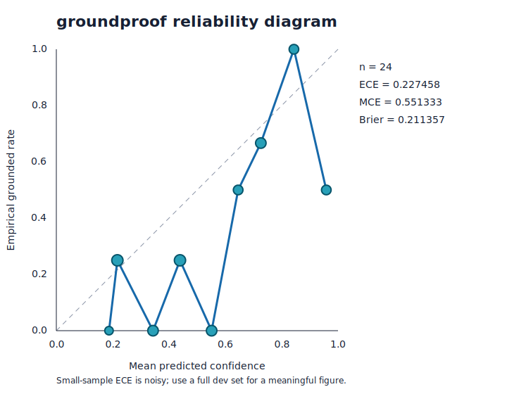

# groundproof

[](./package.json)
[](./test)
[](./LICENSE)
[](./package.json)

**Portable research evidence receipts with independent, reproducible groundedness checks.**

**[▶ Play with it live →](https://groundproof-receipt.vercel.app)** — verify an answer's claims against its evidence, watch the receipt derive, entirely in your browser (the real modules, zero deps).

groundproof turns an answer and its citations into a content-hashed receipt. Each atomic claim keeps
its supporting excerpts, a separate entailment verdict, citation-integrity state, recomputed
confidence, and calibration flags. It understands Parallel Task API `content + basis` directly and
also accepts a provider-neutral schema.

It strengthens rich evidence systems such as Parallel Basis by making their evidence portable and
independently checkable. It is not a fact checker: the bundled offline judge is an explainable
lexical heuristic, and excerpt presence does not establish source authority or truth.

## Quick start

Node.js 18 or newer is the only requirement.

```sh
npm test
npm run demo
node bin/groundproof.js benchmark
node bin/groundproof.js eval
node bin/groundproof.js verify fixtures/parallel-research.json
node bin/groundproof.js receipt fixtures/parallel-research.json > receipt.json
node bin/groundproof.js check receipt.json
```

Install globally if desired:

```sh
npm install -g @avee1234/groundproof
groundproof demo
```

The demo compares a realistic Parallel-shaped response with a naive answer over the same subject.
The Basis-style response scores higher; the baseline's unsupported, asserted-high claim is surfaced
as both unsupported and over-confident. Fixtures are synthetic and require no API key or network.

## Live Parallel, playground, and benchmark

The optional adapter keeps provider I/O out of the pure verifier. The CLI reads its key only from
the environment, creates a Task Run, polls its result, and passes the raw JSON unchanged through the
normal verification and receipt pipeline:

```sh
PARALLEL_API_KEY=... groundproof verify --parallel "What are the latest developments in AI search?"
```

Use `--processor core` to select a tier (default `base`) and `--json` for machine output. This assumes
`POST https://api.parallel.ai/v1/tasks/runs` with `{ input, processor }`, then
`GET /v1/tasks/runs/{run_id}/result`, reading `result.output.content` and `result.output.basis`.
It assumes the current Task API schema—adjust the endpoint/shape to match
[docs.parallel.ai](https://docs.parallel.ai/) if the API differs. The exact wire format cannot be
verified offline.

Live-validated per-field prose Basis entries are heuristically decomposed into atomic claims that
share the field's evidence and asserted confidence; structured enrichment leaves stay one-to-one.

Serve [site/index.html](./site/index.html) as described in [site/README.md](./site/README.md) for the
no-build browser playground. It runs synchronized copies of the real core client-side, including
claim verdicts, recomputed confidence, flags, aggregate score, and WebCrypto receipt identity. It
makes no external requests.

```sh
groundproof benchmark
groundproof benchmark fixtures/benchmark --json
```

The 10 factual items include gold answers, real source URLs, cached excerpts, and grounded/degraded
variants. This is a small hand-curated sample for illustration, not an official benchmark. It shows
separation on deliberate degradations in this sample; it is not a population calibration study, an
accuracy claim, or a substitute for BrowseComp, FRAMES, or SimpleQA. The per-file schema is reusable.

## Calibration and faithfulness evaluation

```sh
groundproof eval
groundproof eval fixtures/eval/sample.jsonl --by asserted
groundproof eval path/to/mapped-dev.jsonl --report reliability.svg --json
```

`eval` judges `{id, claim, excerpt, gold, assertedConfidence?}` JSONL, reports verdict accuracy,
10-bin reliability, ECE, MCE, and Brier score, then writes a self-contained SVG and adjacent JSON.
Gold is `supported`, `contradicted`, or `unsupported`. FEVER maps SUPPORTED/REFUTED/NOT ENOUGH INFO
to those classes; NLI maps entailment/contradiction/neutral. Treating insufficient evidence or
neutrality as unsupported is an explicit evidence-faithfulness assumption, not a truth judgment.

[](./eval-report.svg)

The committed [JSON report](./eval-report.json) and diagram use the default heuristic on 24 balanced,
hand-authored examples. They produce ECE **0.227458 at n=24**. This is a small illustration—not an
official benchmark or population estimate—and every fixed-width bin has fewer than the default five
items, so all are marked low-confidence. Small-sample ECE is noisy; run the loader on a representative
full FEVER/NLI development set for a meaningful figure. `scripts/fetch-eval-dataset.sh` documents an
optional SNLI download, but was not executed in the offline sandbox.

`--by asserted` directly reports the observed grounded rate for low/medium/high provider assertions.
Its ECE/Brier additionally require the documented convention low=0.25, medium=0.60, high=0.90; these
are assumed representatives, not learned provider probabilities.

### Opt-in model judge and agreement

```sh
GROUNDPROOF_JUDGE_API_KEY=... \
GROUNDPROOF_JUDGE_MODEL=your-model \
groundproof eval --judge model

GROUNDPROOF_JUDGE_API_KEY=... \
GROUNDPROOF_JUDGE_MODEL=your-model \
groundproof eval --compare-judges
```

Set `GROUNDPROOF_JUDGE_BASE_URL` to override the default OpenAI-compatible chat-completions endpoint.
The key is never logged or stored; asking for the model judge without a key/model exits non-zero
before a request. The library form injects `complete({system,user})`, so tests use canned outputs and
never use network. Model judgments are non-deterministic. Reports/receipts record the model ID, and
model scores are not directly benchmark-equivalent to heuristic scores without calibration.
`--compare-judges` prints exact-verdict agreement, the heuristic-vs-model confusion matrix, and every
disagreement case; agreement alone does not establish correctness.

## Input formats

Parallel Task API responses are auto-detected:

```json
{
  "result": {
    "output": {
      "content": "The answer…",
      "basis": [{
        "claim": "An atomic claim.",
        "citations": [{ "url": "https://…", "excerpt": "Supporting text…" }],
        "reasoning": "Provider-supplied rationale",
        "confidence": "high"
      }]
    }
  }
}
```

The generic shape is deliberately small:

```json
{
  "answer": { "employees": 42 },
  "claims": [{
    "path": "/employees",
    "text": "employees: 42",
    "confidence": "high",
    "evidence": [{ "url": "https://…", "excerpt": "The company employs 42 people." }]
  }],
  "sources": [{ "url": "https://…", "content": "Optional cached page text…" }]
}
```

If generic claims are omitted, prose is split into sentences and structured answers into one claim
per JSON leaf. Explicit claim mapping is preferable when available.

## Receipt format

Receipts use `groundproof/receipt@1`. Their identity is the SHA-256 of canonical JSON after recursively
excluding `id` and `signature`. Object keys are sorted; array order is retained. A receipt contains:

- the original semantic answer and provider;
- atomic claims with asserted and independently recomputed confidence;
- copied evidence spans with entailment signals and integrity results;
- per-claim and answer-level groundedness scores plus calibration flags;
- an optional HMAC-SHA-256 or Ed25519 signature.

```js
import {
  createReceipt, signEd25519, verifyContentId, verifyEd25519
} from '@avee1234/groundproof';

const receipt = await createReceipt(payload);
const signed = signEd25519(receipt, privateKey, { keyId: 'research-key-1' });
console.log(verifyContentId(signed), verifyEd25519(signed, publicKey));
```

See [DESIGN.md](./DESIGN.md) for the complete schema, scoring weights, thresholds, calibration model,
and real Task API integration boundary.

## CLI

```text
groundproof verify <file|-> [--json] [--network] [--min-score 0.7] [--fail-unsupported]
groundproof verify --parallel <question> [--processor base] [--json]
groundproof receipt <file|-> [--hmac-secret secret | --private-key key.pem]
groundproof check <receipt> [--hmac-secret secret | --public-key key.pem]
groundproof keygen [--out prefix]
groundproof benchmark [dir] [--json]
groundproof eval [dataset] [--judge heuristic|model] [--compare-judges] [--by asserted|recomputed] [--report path.svg] [--json]
groundproof demo
```

Network access is off by default. Cached `sources[].content` can prove local excerpt presence. With
`--network`, cited URLs are fetched explicitly and classified as verified, drifted, or unreachable.
Use a minimum score and `--fail-unsupported` as CI gates; gate failures exit 1, while input/usage
errors exit 2.

Passing secrets on a command line can expose them in shell history or process listings. The CLI flag
is convenient for local demonstration; library callers should load secrets through their own secure
mechanism. Ed25519 public-key trust and distribution remain the caller's responsibility.

## How the heuristic works

The zero-dependency `groundproof-heuristic` combines content-token recall, ordered bigram coverage,
entity agreement, exact normalized number/date agreement, and negation agreement. Conflicting
numbers or polarity are treated as contradictions. Each signal and reason is recorded in the receipt.

This baseline is useful for copied or lightly paraphrased research excerpts and catches common
failures such as swapped statistics, dates, entities, and negation. It can miss valid paraphrases and
can approve a false statement faithfully copied from a source. It only checks evidence support—not
truth, authority, context quality, or completeness. Replace it with an NLI/LLM judge by passing an
object with `{ name, version, judge({ claim, excerpt }) }`; the rest of the format is unchanged.

## Why a format, not a runtime?

Research results move between providers, agents, stores, evaluators, and humans. A receipt that only
works inside its producer cannot be independently retained or rechecked. groundproof keeps the
artifact ordinary JSON, the identity reproducible, and the reference implementation optional. That
makes stronger judges, source policies, and provider adapters composable instead of mandatory.

## Related format family

groundproof follows the same open, harness-neutral philosophy as Abhi Das's formats:

- [provenant](https://github.com/avee1234/provenant) — provenance
- [truecall](https://github.com/avee1234/truecall) — verification evidence
- [capgrant](https://github.com/avee1234/capgrant) — capability grants
- [skillproof](https://github.com/avee1234/skillproof) — skill trust

## License

MIT © Abhi Das. See [LICENSE](./LICENSE).
